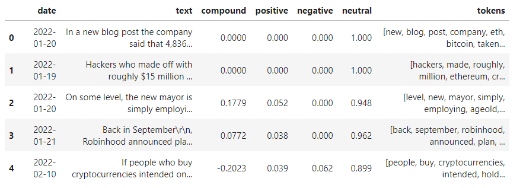
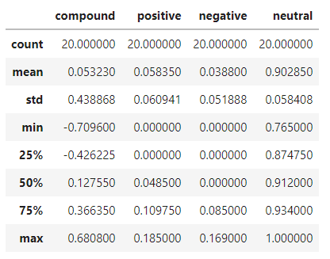
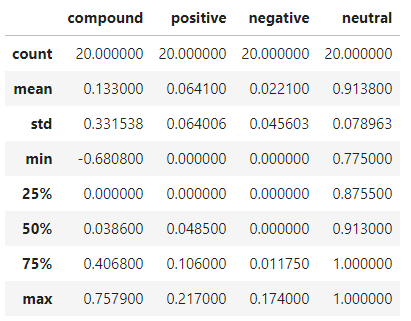
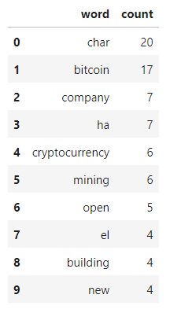
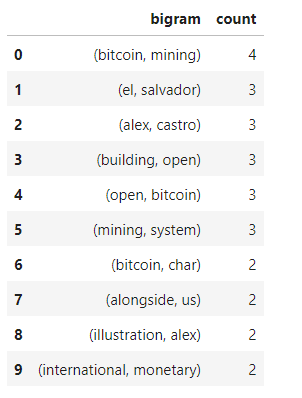
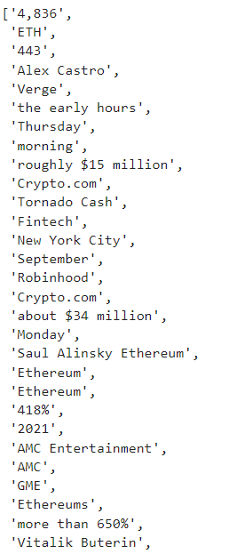

# NLP Analysis of Cryptocurrency

This project is an analysis of the latest news headlines of two cryptocurrencies, Bitcoin and Ethereum, using natural language processing (NLP). NLP is used to understand the sentiment in the Bitcoin and Ethereum news articles. NLP techniques are also used to analyze: words, phrases, organizations, and entities appearing in the news articles. There is only one Jupyter notebook in this project. It includes three types of analysis: Sentiment Analysis, Natural Language Processing, and Named Entity Recognition.

## Sentiment Analysis

For the sentiment analysis, the latest Bitcoin and Ethereum news articles were obtained using the [newsapi](https://newsapi.org/). Then, two DataFrames containing the sentiment scores for each coin were created. Below is a sample of one of the DataFrames.

Ethereum DataFrame

The descriptive statistics of the sentiments were obtained. Following are the screenshots of the outputs for both coins.

Bitcoin Sentiment

Ethereum Sentiment

From the above screenshots, it is evident that Ethereum had the highest: mean positive score, compound score, and positive score.

## Natural Language Processing

As part of the natural language processing, NLTK and Python were used to tokenize, obtain the counts of n-grams, and create word clouds for Bitcoin and Ethereum.

**Tokenize:**

Tokenizing involved putting each article word  in lowercase, removing punctuation, and removing stop words.

**N-grams:**

NLTK was used to obtain the bigrams, ngrams for n=2, for the two cryptocurrencies. Then, the top 10 words for the coins were listed, as well as the top 10 bigrams. Below are the results for the Bitcoin.

Bitcoin Top 10 Words

Bitcoin Top 10 Bigrams

**Word Clouds:**

The last part of the NLP analysis involved summarizing the news through word clouds generated for each coin. Below are the two coins' word clouds.

## Named Entity Recognition

The NER analysis consisted of building an NER model and using SpaCy to visualize the tags, as well as listing the entities for each coin. Following are the results for the Ethereum.

Ethereum Entities

